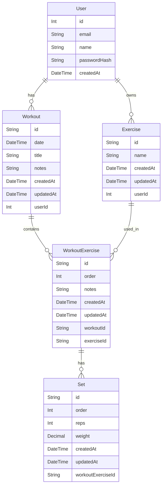

# Database ERD (Prisma)

```mermaid
erDiagram
  User ||--o{ Workout : has
  User ||--o{ Exercise : owns

  Workout ||--o{ WorkoutExercise : contains
  Exercise ||--o{ WorkoutExercise : used_in

  WorkoutExercise ||--o{ Set : has

  User {
    Int id
    String email
    String name
    String passwordHash
    DateTime createdAt
  }

  Workout {
    String id
    DateTime date
    String title
    String notes
    DateTime createdAt
    DateTime updatedAt
    Int userId
  }

  Exercise {
    String id
    String name
    DateTime createdAt
    DateTime updatedAt
    Int userId
  }

  WorkoutExercise {
    String id
    Int order
    String notes
    DateTime createdAt
    DateTime updatedAt
    String workoutId
    String exerciseId
  }

  Set {
    String id
    Int order
    Int reps
    Decimal weight
    DateTime createdAt
    DateTime updatedAt
    String workoutExerciseId
  }
```